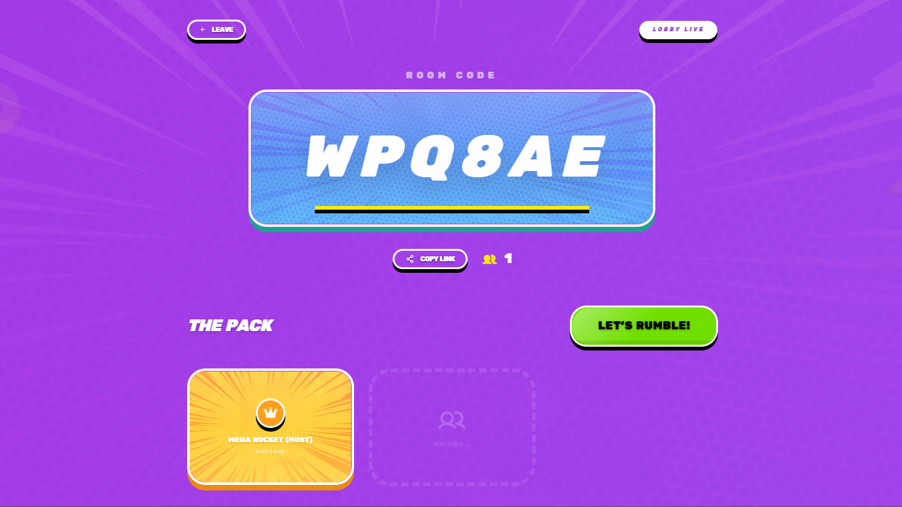
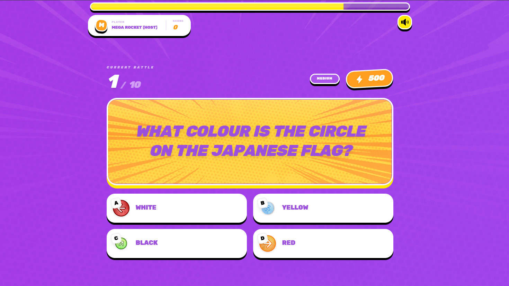

<div align="center">
  <h1>💥 Kapoww</h1>
  <p><strong>A high-energy, real-time multiplayer quiz platform.</strong></p>
</div>

Kapoww is a real-time, interactive, multiplayer quiz platform inspired by Kahoot!. Designed for high-energy live environments, it features vibrant animations, real-time leaderboard updates, and seamless syncing across all devices.

---

## ✨ Capabilities & Features

### 🎮 Real-time Multiplayer Action
Leverages **Supabase Realtime** to ensure millisecond-level syncing between the game host and all connected players. When the host advances a question, players see it instantly!

### 👑 Host Controls & Dashboard
The Host has full control over the pacing of the game. They can wait for players to join the lobby, start the game, skip questions, and reveal the leaderboard.
<br/>


### 🚀 Interactive Player Experience
Players get a distraction-free, vibrant interface to answer questions. They receive instant visual and auditory feedback based on correct/incorrect answers and answer speed.
<br/>


### 🏆 Dynamic Leaderboards
Scores are calculated based on both correctness and speed. The post-game podium celebrates the top 3 players with exciting animations and confetti.
<br/>


### 🎵 Immersive Audio & Visuals
Built with `framer-motion` for buttery-smooth animations and includes an integrated sound system (`SoundContext`) for an authentic game show feel.

---

## 🚀 Deploying Kapoww Yourself

Want to host your own instance of Kapoww? Follow this detailed step-by-step guide to get your backend and frontend running!

### Prerequisites
- [Node.js](https://nodejs.org/) (v18 or higher)
- [npm](https://www.npmjs.com/) or [yarn](https://yarnpkg.com/)
- A free [Supabase](https://supabase.com/) account
- Git

### Step 1: Clone the Repository
Clone the repository to your local machine:
```bash
git clone https://github.com/yourusername/kapoww.git
cd kapoww
```

### Step 2: Set up Supabase (Backend)
Kapoww uses Supabase for its PostgreSQL database and Realtime syncing.

1. Go to [Supabase](https://supabase.com/) and create a new project.
2. Once your project is created, navigate to the **SQL Editor** in the left sidebar.
3. Open the `supabase_setup.sql` file located in the root of this repository.
4. Copy the entire contents of `supabase_setup.sql` and paste it into the Supabase SQL Editor.
5. Click **Run** to execute the SQL. This will create the required tables: `quizzes`, `game_sessions`, `players`, and `leaderboard`, and automatically enable Realtime subscriptions for them.
6. *(Optional)* Add some sample questions to your `quizzes` table via the Supabase Table Editor so you have something to play with! The schema expects JSON arrays for `options`.

### Step 3: Configure Environment Variables
You need to connect your frontend to your newly created Supabase backend.

1. In the root of your local Kapoww repository, rename the `.env.example` file to `.env`:
   ```bash
   mv .env.example .env
   ```
2. Open your Supabase project dashboard and go to **Project Settings > API**.
3. Copy your **Project URL** and paste it as the `VITE_SUPABASE_URL` in your `.env` file.
4. Copy your **anon / public** key and paste it as the `VITE_SUPABASE_ANON_KEY` in your `.env` file.

Your `.env` file should look like this:
```env
VITE_SUPABASE_URL=https://<your-project-id>.supabase.co
VITE_SUPABASE_ANON_KEY=eyJhbGciOiJIUzI1NiIsInR5cCI6...
```

### Step 4: Run the Frontend Locally

1. Install the necessary dependencies:
   ```bash
   npm install
   ```
2. Start the Vite development server:
   ```bash
   npm run dev
   ```
3. Open your browser and navigate to the local URL (usually `http://localhost:3000` or `http://localhost:5173`). 
4. You can now create a game as a Host in one tab, and join as a Player from another tab (or your mobile device)!

### Step 5: Deploying to Production (Vercel, Netlify, GitHub Pages)
Since the app is a standard React + Vite SPA, you can deploy it easily to any static hosting provider.

**For Vercel / Netlify:**
1. Connect your GitHub repository to your hosting provider.
2. Set the Build Command to `npm run build`.
3. Set the Output Directory to `dist`.
4. **Crucial:** Add your `VITE_SUPABASE_URL` and `VITE_SUPABASE_ANON_KEY` to the Environment Variables settings of your hosting provider! Without these, the deployed app won't be able to talk to your database.

## 🛠 Tech Stack
- **Frontend Framework:** React 19 + Vite
- **Styling:** Tailwind CSS v4
- **Animations:** Framer Motion
- **Routing:** React Router v7
- **Backend & Realtime:** Supabase (PostgreSQL)

## 📄 License
This project is open-source and available under the MIT License.
